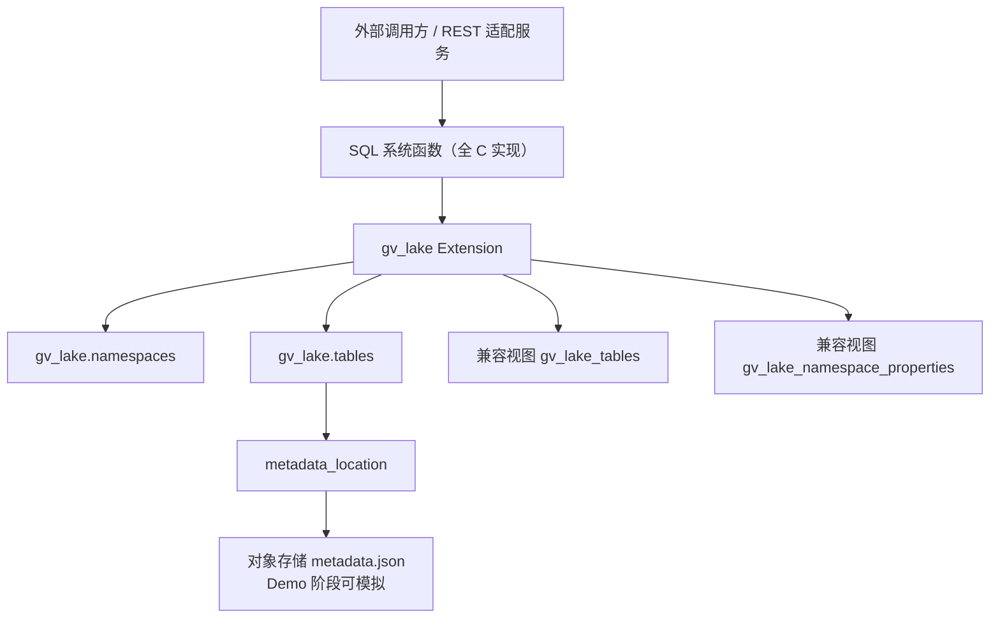

# GV Lake 需求与设计文档

> **gv_lake**: GaussVector with Iceberg and data lake access — 为 GaussVector 提供的 Iceberg 数据湖访问插件。

## 1. 背景

**gv_lake** 是一个 GaussVector（基于 PostgreSQL 生态）的扩展插件，核心目标是为 GaussVector 提供 Iceberg Catalog 元信息管理能力，打通 GaussVector 与数据湖（Data Lake）的连接通道。

插件名 `gv_lake` 的含义：
- **gv** = GaussVector
- **lake** = 数据湖（Data Lake）/ Iceberg

该插件不追求完整 Iceberg 查询引擎能力，也不实现完整 Parquet 扫描、FDW 查询、DML 写入或完整对象存储生命周期管理，而是优先验证以下核心能力：

1. 在 GaussVector 插件中创建 Iceberg Catalog 元信息表。
2. 维护 `namespace + table_name -> metadata_location` 的映射关系。
3. 通过 SQL 系统函数模拟 Iceberg REST Catalog 的核心端点。
4. 通过 `commit_table(...)` 函数实现 metadata pointer 的 CAS 更新。
5. 提供兼容 Iceberg JDBC Catalog 的视图结构，验证外部生态兼容思路。
6. 为后续扩展到 GaussVector 完整插件化实现提供原型参考。

## 2. 目标

### 2.1 插件目标

本插件专为 GaussVector 设计，名称为：

```text
gv_lake  (GaussVector with Iceberg and data lake access)
```

安装方式：

```sql
CREATE EXTENSION gv_lake;
```

安装完成后，数据库中自动创建：

```text
gv_lake schema
gv_lake.namespaces
gv_lake.tables
gv_lake.purge_queue
gv_lake_tables 兼容视图
gv_lake_namespace_properties 兼容视图
一组 gv_lake.* 系统函数（全 C 语言实现）
```

### 2.2 核心验证点

本插件重点验证：

| 验证点                | 说明                                                         |
| --------------------- | ------------------------------------------------------------ |
| Catalog 元信息表设计  | 是否能用 PostgreSQL 表维护 Iceberg 表入口信息                |
| JDBC Catalog 兼容视图 | 是否能通过视图映射成 `gv_lake_tables` / `gv_lake_namespace_properties` |
| REST 端点函数化       | 是否能把 REST Catalog 操作映射成 SQL 函数                    |
| CAS commit            | 是否能通过 `expected_metadata_location` 防止并发覆盖         |
| 外部 REST 适配可行性  | 外部 REST 服务能否只做 HTTP <-> SQL 翻译                     |
| 插件化交付            | 是否能以 PostgreSQL extension 形式安装、升级和卸载           |
| 全 C 实现             | 所有核心函数均为 C 语言实现，通过 SPI 执行 SQL               |

## 3. 非目标

本插件不做以下内容：

1. 不实现完整 Iceberg Java SDK / PyIceberg / Rust / C++ SDK。
2. 不实现真实 Parquet 文件写入。
3. 不实现 manifest / manifest list 的完整 Avro 读写。
4. 不实现对象存储访问。
5. 不实现 FDW 查询 Iceberg 表。
6. 不实现 Spark / Trino / Flink 的完整联调。
7. 不实现 row-level delete、position delete、equality delete。
8. 不实现 branch / tag。
9. 不实现数据库级 2PC。
10. 不保证生产级 REST Catalog 一致性。

### 3.1 MVP 约束与边界

1. 仅支持单层 namespace，例如 `sales`，不支持多段 namespace 路径编码。
2. 仅支持单一 `catalog_name='default'`，不实现多 catalog 路由。
3. `metadata_json` 主要用于模拟 Iceberg metadata 内容，不要求与某个 Iceberg 版本的全部字段完全对齐。
4. Demo 的核心验收对象是 PostgreSQL extension 的安装、SQL 函数行为、CAS 语义和兼容视图，不以真实对象存储联动为验收前提。
5. `drop_table(..., p_purge => true)` 语义要求提供 `purge_queue` 记录表；该表只记录待清理对象，不负责真实删除。

## 4. 总体架构

### 4.1 架构图



### 4.2 架构说明

该插件采用数据库内 Catalog 管理模式。

PostgreSQL 插件负责维护 Catalog 元信息表。外部 REST 适配服务不直接操作底层表，而是通过 SQL 函数调用 Catalog 能力。例如：

```sql
SELECT * FROM gv_lake.create_namespace('sales', '{"owner": "team_a"}');

SELECT * FROM gv_lake.create_table(
    'sales',
    'orders',
    '{"type":"struct","fields":[]}'::jsonb,
    NULL,
    '{}'::jsonb,
    's3://bucket/sales/orders'
);

SELECT * FROM gv_lake.commit_table(
    'sales',
    'orders',
    's3://bucket/sales/orders/metadata/v1.metadata.json',
    's3://bucket/sales/orders/metadata/v2.metadata.json'
);
```

## 5. 元信息表设计

### 5.1 设计原则

Iceberg 的 `metadata.json` 是自包含的，包含 schema、partition spec、snapshots、current snapshot、properties 等完整表元数据。因此 Catalog MVP 不需要将全部 Iceberg 元数据展开存入数据库。

Catalog 主表只需要维护：

```text
catalog_name + namespace + table_name -> metadata_location
```

其中 `metadata_location` 是当前生效的 Iceberg `metadata.json` 地址。

### 5.2 Schema

插件安装时创建：

```sql
CREATE SCHEMA IF NOT EXISTS gv_lake;
```

### 5.3 Namespace 表

```sql
CREATE TABLE gv_lake.namespaces (
    namespace       TEXT PRIMARY KEY,
    properties      JSONB DEFAULT '{}'::jsonb,
    created_at      TIMESTAMPTZ DEFAULT now(),
    updated_at      TIMESTAMPTZ DEFAULT now()
);
```

字段说明：

| 字段         | 说明                                   |
| ------------ | -------------------------------------- |
| `namespace`  | Iceberg namespace 名称                 |
| `properties` | namespace 属性，用 JSONB 存储           |
| `created_at` | 创建时间                               |
| `updated_at` | 更新时间                               |

### 5.4 Table 元信息表

```sql
CREATE TABLE gv_lake.tables (
    id                          BIGSERIAL PRIMARY KEY,
    catalog_name                TEXT NOT NULL DEFAULT 'default',
    namespace                   TEXT NOT NULL,
    table_name                  TEXT NOT NULL,
    table_uuid                  UUID NOT NULL DEFAULT gen_random_uuid(),
    metadata_location           TEXT NOT NULL,
    previous_metadata_location  TEXT,
    table_location              TEXT,
    iceberg_type                VARCHAR(5) NOT NULL DEFAULT 'TABLE',
    properties                  JSONB DEFAULT '{}'::jsonb,
    metadata_json               JSONB DEFAULT '{}'::jsonb,
    created_at                  TIMESTAMPTZ DEFAULT now(),
    updated_at                  TIMESTAMPTZ DEFAULT now(),

    UNIQUE (catalog_name, namespace, table_name),
    UNIQUE (table_uuid),
    FOREIGN KEY (namespace)
        REFERENCES gv_lake.namespaces(namespace)
        ON DELETE CASCADE
);
```

字段说明：

| 字段                         | 说明                             |
| ---------------------------- | -------------------------------- |
| `id`                         | 内部主键                         |
| `catalog_name`               | Catalog 标识，默认 `default`     |
| `namespace`                  | 表所属 namespace                 |
| `table_name`                 | Iceberg 表名                     |
| `table_uuid`                 | Iceberg 表唯一标识               |
| `metadata_location`          | 当前生效的 `metadata.json` 路径  |
| `previous_metadata_location` | 上一个 `metadata.json` 路径      |
| `table_location`             | 表根路径                         |
| `iceberg_type`               | `TABLE` 或 `VIEW`                |
| `properties`                 | 表属性                           |
| `metadata_json`              | 模拟 metadata.json 内容           |
| `created_at` / `updated_at`  | 审计字段                         |

### 5.5 Purge 队列表

```sql
CREATE TABLE gv_lake.purge_queue (
    id                  BIGSERIAL PRIMARY KEY,
    namespace           TEXT NOT NULL,
    table_name          TEXT NOT NULL,
    metadata_location   TEXT NOT NULL,
    enqueued_at         TIMESTAMPTZ DEFAULT now(),
    processed_at        TIMESTAMPTZ
);
```

说明：

- 只记录 purge 意图，不执行真实对象存储删除。

## 6. 兼容 Iceberg JDBC Catalog 视图

### 6.1 `gv_lake_tables` 视图

```sql
CREATE OR REPLACE VIEW gv_lake_tables AS
SELECT
    catalog_name,
    namespace AS table_namespace,
    table_name,
    metadata_location,
    previous_metadata_location,
    iceberg_type
FROM gv_lake.tables;
```

### 6.2 `gv_lake_namespace_properties` 视图

```sql
CREATE OR REPLACE VIEW gv_lake_namespace_properties AS
SELECT
    'default'::TEXT AS catalog_name,
    namespace,
    key AS property_key,
    value AS property_value
FROM gv_lake.namespaces,
     LATERAL jsonb_each_text(properties) AS props(key, value);
```

## 7. 系统函数设计

### 7.1 函数总览

所有核心函数均为 C 语言实现，通过 SPI (Server Programming Interface) 执行 SQL 操作。`alter_table` 为 SQL wrapper，内部调用 `commit_table`。

| 函数               | REST 端点语义         | 实现语言 |
| ------------------ | --------------------- | -------- |
| `create_namespace` | POST namespaces       | C        |
| `drop_namespace`   | DELETE namespace      | C        |
| `list_namespaces`  | GET namespaces        | C        |
| `create_table`     | POST tables           | C        |
| `register_table`   | POST register         | C        |
| `load_table`       | GET table             | C        |
| `list_tables`      | GET tables            | C        |
| `drop_table`       | DELETE table          | C        |
| `unregister_table` | DELETE table no purge | C        |
| `rename_table`     | POST rename           | C        |
| `commit_table`     | POST table commit     | C (核心) |
| `alter_table`      | POST table update     | SQL wrapper |

### 7.2 错误与返回约定

| 场景 | SQLSTATE | HTTP 映射 |
| ---- | -------- | --------- |
| namespace 已存在 | `23505` | `409 Conflict` |
| table 已存在 | `23505` | `409 Conflict` |
| namespace 不存在 | `P0002` | `404 Not Found` |
| table 不存在 | `P0002` | `404 Not Found` |
| namespace 非空不可删 | `P0001` | `409 Conflict` |
| commit 冲突 | `40001` | `409 Conflict` |
| 参数非法 | `22023` | `400 Bad Request` |

## 8. C 函数实现架构

### 8.1 文件结构

```text
src/
├── gv_lake.c        # 模块入口，PG_MODULE_MAGIC
├── namespace.c       # create_namespace, drop_namespace, list_namespaces
├── table_ops.c       # list_tables, register_table, drop_table, unregister_table, rename_table
├── commit_table.c    # commit_table (核心 CAS 实现)
├── create_table.c    # create_table (UUID 生成，metadata_json 构建)
├── load_table.c      # load_table
├── utils.c           # 错误处理，UUID 生成工具
└── utils.h           # 头文件
```

### 8.2 SPI 使用模式

所有 C 函数通过 SPI (Server Programming Interface) 执行 SQL：

```c
SPI_connect();

/* 准备 SQL 语句 */
SPIPlanPtr plan = SPI_prepare(sql, nargs, argtypes);

/* 执行 */
SPI_execute_plan(plan, values, nulls, false, 0);

/* 获取结果 */
HeapTuple tuple = SPI_tuptable->vals[0];
char *value = SPI_getvalue(tuple, SPI_tuptable->tupdesc, colnum);

SPI_finish();
```

### 8.3 返回值构建

返回 TABLE 类型的函数使用 `BuildTupleFromCStrings`：

```c
get_call_result_type(fcinfo, NULL, &tupdesc);
BlessTupleDesc(tupdesc);
AttInMetadata *attinmeta = TupleDescGetAttInMetadata(tupdesc);

char **str_values = (char **) palloc(sizeof(char *) * ncols);
// ... 填充 str_values ...

HeapTuple result_tuple = BuildTupleFromCStrings(attinmeta, str_values);
Datum result_datum = HeapTupleGetDatum(result_tuple);
PG_RETURN_DATUM(result_datum);
```

### 8.4 错误处理

使用 `ereport` 抛出标准 SQLSTATE 错误：

```c
ereport(ERROR,
        (errcode(ERRCODE_UNIQUE_VIOLATION),
         errmsg("Namespace already exists: %s", ns_text)));

ereport(ERROR,
        (errcode(ERRCODE_T_R_SERIALIZATION_FAILURE),
         errmsg("Commit conflict for %s.%s: expected metadata_location %s",
                namespace, table_name, expected)));
```

### 8.5 SET 返回函数 (SRF)

`list_namespaces` 和 `list_tables` 使用标准的 SRF 模式：

- `SRF_IS_FIRSTCALL()` → 初始化，执行查询
- `SRF_PERCALL_SETUP()` → 逐行遍历
- `SRF_RETURN_NEXT()` → 返回当前行
- `SRF_RETURN_DONE()` → 结束

## 9. 函数详细设计

### 9.1 `create_namespace` (C)

```sql
CREATE FUNCTION gv_lake.create_namespace(
    p_namespace TEXT,
    p_properties JSONB DEFAULT '{}'::jsonb
)
RETURNS TABLE (namespace TEXT, properties JSONB)
AS 'gv_lake', 'gv_lake_create_namespace'
LANGUAGE C;
```

C 实现逻辑：
1. SPI 连接
2. 检查 namespace 是否已存在
3. 若存在，抛出 `ERRCODE_UNIQUE_VIOLATION`
4. INSERT INTO gv_lake.namespaces
5. SELECT 返回创建的记录
6. 构建 tuple 返回

### 9.2 `drop_namespace` (C)

```sql
CREATE FUNCTION gv_lake.drop_namespace(p_namespace TEXT)
RETURNS BOOLEAN
AS 'gv_lake', 'gv_lake_drop_namespace'
LANGUAGE C STRICT;
```

C 实现逻辑：
1. SPI 连接
2. SELECT count(*) FROM gv_lake.tables WHERE namespace = $1
3. 若 count > 0，抛出 "Namespace is not empty" 错误
4. DELETE FROM gv_lake.namespaces WHERE namespace = $1
5. 若未删除任何行，抛出 "Namespace not found"
6. 返回 true

### 9.3 `list_namespaces` (C, SRF)

```sql
CREATE FUNCTION gv_lake.list_namespaces()
RETURNS TABLE (namespace TEXT, properties JSONB)
AS 'gv_lake', 'gv_lake_list_namespaces'
LANGUAGE C;
```

使用 SRF 模式返回所有 namespace。

### 9.4 `commit_table` (C - 核心 CAS)

```sql
CREATE FUNCTION gv_lake.commit_table(
    p_namespace TEXT,
    p_table_name TEXT,
    p_expected_metadata_location TEXT,
    p_new_metadata_location TEXT,
    p_new_metadata_json JSONB DEFAULT NULL
)
RETURNS TABLE (namespace TEXT, table_name TEXT, table_uuid UUID,
               metadata_location TEXT, metadata_json JSONB)
AS 'gv_lake', 'gv_lake_commit_table'
LANGUAGE C STRICT;
```

CAS 语义实现：
1. UPDATE gv_lake.tables SET ... WHERE metadata_location = $expected
2. 检查 rows_updated
3. 若 0 行更新 → 检查表是否存在 → throw_table_not_found 或 throw_commit_conflict
4. 返回更新后的记录

### 9.5 `create_table` (C)

```sql
CREATE FUNCTION gv_lake.create_table(
    p_namespace TEXT,
    p_table_name TEXT,
    p_schema_json JSONB,
    p_partition_spec JSONB DEFAULT NULL,
    p_properties JSONB DEFAULT '{}'::jsonb,
    p_location TEXT DEFAULT NULL
)
RETURNS TABLE (namespace TEXT, table_name TEXT, table_uuid UUID,
               metadata_location TEXT, metadata_json JSONB)
AS 'gv_lake', 'gv_lake_create_table'
LANGUAGE C;
```

C 实现逻辑：
1. 验证 namespace 存在
2. 验证 table 不重复
3. 生成 UUID (C 自实现)
4. 构建 metadata_location 路径
5. 通过 SQL jsonb_build_object 构建 metadata_json
6. INSERT INTO gv_lake.tables
7. 返回创建的记录

### 9.6-9.11 其他 C 函数

| 函数 | C 符号 |
|------|--------|
| `load_table` | `gv_lake_load_table` |
| `list_tables` | `gv_lake_list_tables` (SRF) |
| `register_table` | `gv_lake_register_table` |
| `drop_table` | `gv_lake_drop_table` |
| `unregister_table` | `gv_lake_unregister_table` |
| `rename_table` | `gv_lake_rename_table` |

### 9.12 `alter_table` (SQL Wrapper)

```sql
CREATE OR REPLACE FUNCTION gv_lake.alter_table(
    p_namespace TEXT,
    p_table_name TEXT,
    p_expected_metadata_location TEXT,
    p_new_metadata_location TEXT,
    p_updates_json JSONB DEFAULT '{}'::jsonb,
    p_new_metadata_json JSONB DEFAULT NULL
)
RETURNS TABLE (...)
LANGUAGE sql
AS $$
    SELECT * FROM gv_lake.commit_table(
        p_namespace, p_table_name, p_expected_metadata_location,
        p_new_metadata_location, COALESCE(p_new_metadata_json, p_updates_json)
    );
$$;
```

## 10. REST 端点到系统函数映射

| REST Catalog 端点语义                                | HTTP 方法 | 系统函数                               |
| ---------------------------------------------------- | --------- | -------------------------------------- |
| `/v1/{prefix}/namespaces`                            | GET       | `list_namespaces()`                    |
| `/v1/{prefix}/namespaces`                            | POST      | `create_namespace()`                   |
| `/v1/{prefix}/namespaces/{namespace}`                | DELETE    | `drop_namespace()`                     |
| `/v1/{prefix}/namespaces/{namespace}/tables`         | GET       | `list_tables(namespace)`               |
| `/v1/{prefix}/namespaces/{namespace}/tables`         | POST      | `create_table(...)`                    |
| `/v1/{prefix}/namespaces/{namespace}/tables/{table}` | GET       | `load_table(namespace, table)`         |
| `/v1/{prefix}/namespaces/{namespace}/register`       | POST      | `register_table(...)`                  |
| `/v1/{prefix}/namespaces/{namespace}/tables/{table}` | POST      | `commit_table(...)` / `alter_table(...)` |
| `/v1/{prefix}/namespaces/{namespace}/tables/{table}` | DELETE    | `drop_table(...)` / `unregister_table(...)` |
| `/v1/tables/rename`                                  | POST      | `rename_table(...)`                    |

## 11. 插件工程结构

### 11.1 工程目录

```text
gv_lake/
├── gv_lake.control              # Extension 控制文件
├── Makefile                     # PGXS 构建配置
├── src/
│   ├── gv_lake.c                # 模块入口 (PG_MODULE_MAGIC, _PG_init)
│   ├── namespace.c              # namespace 相关函数 (3个)
│   ├── table_ops.c              # table 操作函数 (5个)
│   ├── commit_table.c           # CAS commit 核心实现
│   ├── create_table.c           # 表创建，UUID 生成
│   ├── load_table.c             # 表加载
│   ├── utils.c                  # 工具函数 (错误处理, UUID)
│   └── utils.h                  # 头文件
├── sql/
│   └── gv_lake--1.0.sql         # 安装 SQL (schema + 表 + 视图 + C 函数定义)
└── tests/
    ├── smoke_test.sql           # Smoke 测试脚本
    └── test_all_c.sql           # 全 C 函数验证
```

### 11.2 control 文件

```text
comment = 'GV Lake: Iceberg Catalog metadata management with full C implementation'
default_version = '1.0'
relocatable = false
requires = 'pgcrypto'
module_pathname = '$libdir/gv_lake'
```

### 11.3 Makefile

```makefile
EXTENSION = gv_lake
MODULE_big = gv_lake
OBJS = src/gv_lake.o \
       src/commit_table.o \
       src/create_table.o \
       src/load_table.o \
       src/namespace.o \
       src/table_ops.o \
       src/utils.o

DATA = sql/gv_lake--1.0.sql

PG_CONFIG = pg_config
PGXS := $(shell $(PG_CONFIG) --pgxs)
include $(PGXS)
```

### 11.4 编译产物

编译后生成：

```text
gv_lake.so           # Shared library (Linux)
gv_lake.bc           # LLVM bitcode (JIT 支持)
```

安装到 PostgreSQL 目录：

```text
/usr/lib/postgresql/16/lib/gv_lake.so
/usr/share/postgresql/16/extension/gv_lake.control
/usr/share/postgresql/16/extension/gv_lake--1.0.sql
```

## 12. WSL 环境与构建

### 12.1 环境要求

- WSL distro: Ubuntu 22.04+
- PostgreSQL: 16.x
- 编译工具: make, gcc, clang (用于 bitcode), libpq-dev, postgresql-server-dev-*
- Build mode: PGXS with shared library

### 12.2 构建与安装步骤

```bash
# 1. 安装依赖
sudo apt update
sudo apt install -y postgresql postgresql-server-dev-all make gcc libpq-dev

# 2. 进入项目目录
cd /mnt/d/project/gv_lake/gv_lake

# 3. 编译
make clean
make

# 4. 安装
sudo make install

# 5. 启动 PostgreSQL
sudo service postgresql start

# 6. 创建 extension
psql -d postgres -c "CREATE EXTENSION IF NOT EXISTS pgcrypto;"
psql -d postgres -c "CREATE EXTENSION IF NOT EXISTS gv_lake;"

# 7. 验证 C 函数绑定
psql -d postgres -c "SELECT proname, prosrc FROM pg_proc WHERE pronamespace = 'gv_lake'::regnamespace;"

# 8. 运行测试
psql -d postgres -f tests/test_all_c.sql
```

## 13. 测试用例

### 13.1 基础功能测试

| 用例 | 预期 | C 函数 |
| ---- | ---- | ------ |
| 创建 namespace | 成功 | `gv_lake_create_namespace` |
| 重复创建 namespace | 报错 409 | `ERRCODE_UNIQUE_VIOLATION` |
| 删除非空 namespace | 报错 | `gv_lake_drop_namespace` |
| 创建 table | 成功 | `gv_lake_create_table` |
| 重复创建 table | 报错 409 | 检查后抛出 |
| namespace 不存在时创建 table | 报错 | `throw_namespace_not_found` |
| load table | 返回 metadata | `gv_lake_load_table` |
| load 不存在 table | 报错 404 | `throw_table_not_found` |
| list tables | 返回表列表 | `gv_lake_list_tables` (SRF) |
| 查看 `gv_lake_tables` | 返回兼容视图 | 视图定义 |
| 查看 `gv_lake_namespace_properties` | 返回属性 KV 视图 | 视图定义 |
| register table | 成功 | `gv_lake_register_table` |
| unregister table | 成功 | `gv_lake_unregister_table` |
| rename table | 成功 | `gv_lake_rename_table` |

### 13.2 Commit 测试 (C 核心)

| 用例 | 预期 | 实现 |
| ---- | ---- | ---- |
| expected location 正确 | commit 成功 | SPI_execute_plan UPDATE |
| expected location 过期 | 报 serialization_failure | `ERRCODE_T_R_SERIALIZATION_FAILURE` |
| table 不存在 | 报 table not found | `throw_table_not_found` |
| commit 后 previous_metadata_location 被更新 | 成功 | UPDATE 语句 |
| commit 后 metadata_location 被更新 | 成功 | UPDATE 语句 |
| commit 不传 p_new_metadata_json | 保留原 metadata_json | COALESCE 逻辑 |

### 13.3 Drop / Purge 测试

| 用例 | 预期 | C 函数 |
| ---- | ---- | ------ |
| `drop_table(..., false)` | 表记录删除，不写入 purge_queue | `gv_lake_drop_table` |
| `drop_table(..., true)` | 表记录删除，purge_queue 增加记录 | SPI INSERT |
| 删除不存在 table | 报错 404 | `throw_table_not_found` |

## 14. 使用示例

```sql
-- 安装插件
CREATE EXTENSION gv_lake;

-- 创建 namespace
SELECT * FROM gv_lake.create_namespace('sales', '{"owner":"team_a"}'::jsonb);

-- 创建表
SELECT * FROM gv_lake.create_table(
    'sales',
    'orders',
    '{"type":"struct","schema-id":0,"fields":[{"id":1,"name":"id","required":true,"type":"long"},{"id":2,"name":"amount","required":false,"type":"double"}]}'::jsonb,
    NULL,
    '{"format-version":"2"}'::jsonb,
    's3://demo-bucket/sales/orders'
);

-- 加载表
SELECT * FROM gv_lake.load_table('sales', 'orders');

-- 查看兼容视图
SELECT * FROM gv_lake_tables;
SELECT * FROM gv_lake_namespace_properties;

-- CAS 提交
SELECT * FROM gv_lake.commit_table(
    'sales', 'orders',
    's3://demo-bucket/sales/orders/metadata/v1.metadata.json',
    's3://demo-bucket/sales/orders/metadata/v2.metadata.json',
    '{"format-version":2,"current-snapshot-id":1001}'::jsonb
);
```

## 15. 后续演进方向

1. **接入真实 Iceberg metadata parser**: 读取真实 metadata.json，校验 schema / snapshot / partition spec
2. **接入对象存储**: S3 / MinIO / OBS / 本地文件系统
3. **REST 适配服务**: 轻量 HTTP → SQL 协议翻译层
4. **FDW 查询集成**: CREATE FOREIGN TABLE → load_table → 解析 manifest → 生成 scan plan → 读取 Parquet
5. **openGauss / GaussVector 迁移**: 将设计迁移到 openGauss / GaussVector 插件体系

## 16. 代码统计

| 类型 | 文件数 | 说明 |
|------|--------|------|
| C 源文件 | 7 | ~800 行 |
| C 头文件 | 1 | ~30 行 |
| SQL 文件 | 1 | 安装脚本，~180 行 |
| 测试脚本 | 2 | ~200 行 |
| 构建文件 | 2 | Makefile + control |

## 17. 最终结论

本插件的核心价值在于验证 GaussVector 中 Iceberg 数据湖访问的可行性：

```text
GaussVector extension
  + Catalog 元信息表 (SQL 创建)
  + JDBC Catalog 兼容视图 (SQL 定义)
  + REST 端点系统函数 (全 C 实现)
  + CAS metadata_location commit (C SPI 实现)
  + Shared library 编译安装 (PGXS)
```

这条链路完全可行，且所有 11 个核心函数均为 C 语言实现，通过 SPI 执行 SQL 操作，保持语义一致性。

---

**文档版本:** v1.0
**更新日期:** 2026-06-02
**实现状态:** 全 C 实现，项目初始化完成
